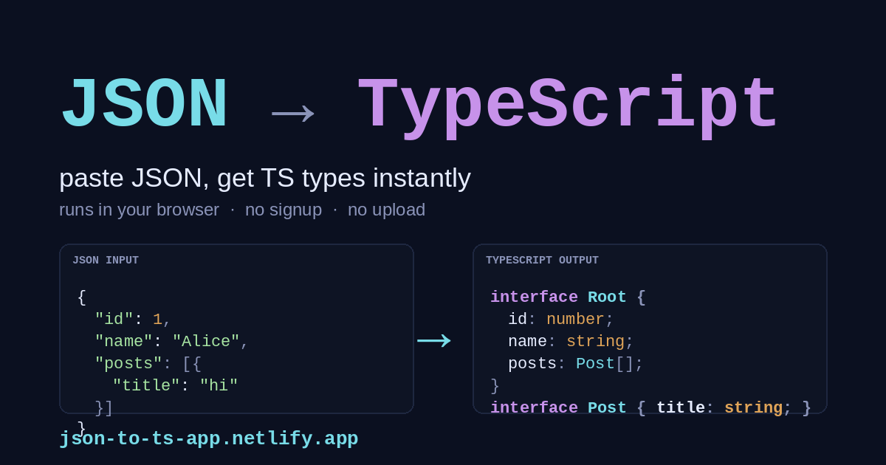

# JSON to TypeScript

Paste JSON, get **TypeScript interfaces, Zod schemas, or Valibot schemas** instantly. Zero signup, zero upload — runs entirely in your browser.

[](LICENSE)
[](https://json-to-ts-app.netlify.app/)
[](https://json-to-ts-app.netlify.app/)
[](#long-tail-landing-pages)
[](https://json-to-ts-app.netlify.app/api/)

## Try it now

**→ [json-to-ts-app.netlify.app](https://json-to-ts-app.netlify.app/) ←**

Paste JSON on the left, copy the output on the right. Toggle between TypeScript / Zod / Valibot with one click. Live conversion as you type — no "Convert" button, no upload, no signup.



## What you get

Paste this JSON:

```json
{
  "id": 42,
  "email": "ada@example.com",
  "name": "Ada Lovelace",
  "active": true,
  "tags": ["admin", "owner"]
}
```

Get any of these three outputs (one click to switch):

**TypeScript interface**

```ts
export interface RootObject {
  id: number;
  email: string;
  name: string;
  active: boolean;
  tags: string[];
}
```

**Zod schema** — runtime validation + inferred TS type

```ts
import { z } from "zod";

export const RootObject = z.object({
  id: z.number(),
  email: z.string(),
  name: z.string(),
  active: z.boolean(),
  tags: z.array(z.string()),
});

export type RootObject = z.infer<typeof RootObject>;
```

**Valibot schema** — same idea, ~10× smaller bundle

```ts
import * as v from "valibot";

export const RootObject = v.object({
  id: v.number(),
  email: v.string(),
  name: v.string(),
  active: v.boolean(),
  tags: v.array(v.string()),
});

export type RootObject = v.InferOutput<typeof RootObject>;
```

Optional chains, unions, nested objects, and arrays-of-objects all generate named types so you can refer to them downstream.

## Why this exists

Most "JSON to TypeScript" tools are buried inside multi-language code generators (quicktype, transform.tools, json2ts.com). They work, but the conversion you want is three clicks deep, the page is slow, and half the UI is irrelevant.

This is the opposite. One page, one job:

- **Focus** — JSON in, TypeScript / Zod / Valibot out. Nothing else.
- **Speed** — live conversion as you type. No "Convert" button, no roundtrip to a server.
- **Three output modes** — pick whichever your stack already uses. Same input, three real targets.

## Long-tail landing pages

Dedicated pages for the JSON shapes developers actually paste — Stripe webhooks, GitHub API responses, OpenAI chat completions, AWS Lambda events, JSON:API, etc. Each shape ships in all three output modes (TS / Zod / Valibot), so the same Stripe payload can become an interface, a runtime guard, or a Valibot schema with a one-click switch.

**By output**

- **TypeScript interfaces** — [Stripe webhook](https://json-to-ts-app.netlify.app/stripe-webhook-to-typescript/) · [GitHub API](https://json-to-ts-app.netlify.app/github-api-to-typescript/) · [OpenAI chat completion](https://json-to-ts-app.netlify.app/openai-chat-completion-to-typescript/) · [AWS Lambda event](https://json-to-ts-app.netlify.app/aws-lambda-event-to-typescript/) · [Slack message](https://json-to-ts-app.netlify.app/slack-message-to-typescript/)
- **Zod schemas** — [Stripe webhook](https://json-to-ts-app.netlify.app/stripe-webhook-to-zod/) · [Shopify webhook](https://json-to-ts-app.netlify.app/shopify-webhook-to-zod/) · [Sentry event](https://json-to-ts-app.netlify.app/sentry-event-to-zod/) · [Notion page](https://json-to-ts-app.netlify.app/notion-page-to-zod/) · [npm registry](https://json-to-ts-app.netlify.app/npm-registry-to-zod/)
- **Valibot schemas** — [Stripe webhook](https://json-to-ts-app.netlify.app/stripe-webhook-to-valibot/) · [Discord webhook](https://json-to-ts-app.netlify.app/discord-webhook-to-valibot/) · [PostHog event](https://json-to-ts-app.netlify.app/posthog-event-to-valibot/) · [Segment track](https://json-to-ts-app.netlify.app/segment-track-to-valibot/) · [package.json](https://json-to-ts-app.netlify.app/package-json-to-valibot/)

**Compared with other tools** — [vs quicktype](https://json-to-ts-app.netlify.app/json-to-ts-vs-quicktype/) · [vs transform.tools](https://json-to-ts-app.netlify.app/json-to-ts-vs-transform-tools/) · [vs json2ts](https://json-to-ts-app.netlify.app/json-to-ts-vs-json2ts/) · [vs json-to-typescript CLI](https://json-to-ts-app.netlify.app/json-to-ts-vs-json-to-typescript-cli/)

15 named shapes × 3 validators + 4 head-to-head comparisons + 6 framework × validator pages + 1 HTTP API docs page = 56 landing pages, all generator-driven from a single dict in `tools/build_landing.py`.

## HTTP API

Same algorithm exposed at a public HTTP endpoint — for shell scripts, CI jobs, Postman collections, or any HTTP-native caller. Free, no signup, no API key.

```sh
curl -X POST https://json-to-ts-app.netlify.app/api/convert \
  -H 'Content-Type: application/json' \
  -d '{"json":"{\"id\":42,\"email\":\"ada@example.com\"}","mode":"ts","root":"User"}'
# → {"output":"interface User {\n  id: number;\n  email: string;\n}\n"}
```

Modes: `ts` (default — pass `"type": true` for a `type` alias instead of `interface`), `zod`, `valibot`. Full docs and three copy-pasteable curl examples at **[/api/](https://json-to-ts-app.netlify.app/api/)**.

## GitHub Action

Want this to run inside a CI workflow and commit the regenerated types back into your repo? Use the wrapper Action — composite (bash), no Node setup, ~1s cold start.

```yaml
- uses: SolvoHQ/json-to-ts-action@v1
  with:
    json: '{"id": 42, "email": "ada@example.com"}'
    mode: ts                       # ts | zod | valibot
    root: User
    output-path: src/types/user.ts
```

Source + full inputs reference: **[github.com/SolvoHQ/json-to-ts-action](https://github.com/SolvoHQ/json-to-ts-action)**.

## Local development

There's no build step and no backend. Open the file:

```sh
open code/index.html
# or
python3 -m http.server -d code 8000
```

Everything is one self-contained HTML file with vanilla JS — no frameworks, no bundlers, no npm install.

## Repository layout

```
code/                                Live site root (deployed to Netlify)
  index.html                         The converter (TS + Zod + Valibot)
  og-image.png                       Social preview image
  robots.txt, sitemap.xml            SEO basics
  netlify.toml                       Functions dir + /api/convert rewrite
  netlify/functions/convert.js       HTTP API — same algorithm as the UI
  <slug>/index.html                  Long-tail landing pages
cli/
  index.js, bin.js                   @solvohq/json-to-ts npm CLI source
tools/
  build_landing.py                   Generator for landing pages
  build_og_image.py                  Generator for og-image.png from og-image.svg
  deploy.sh                          Netlify upload + IndexNow ping wrapper
  indexnow_ping.py                   Submits sitemap URLs to Bing/DDG/Yandex
```

Adding a new long-tail landing page is one dict entry in `tools/build_landing.py` plus a redeploy.

## License

MIT — see [LICENSE](LICENSE).
